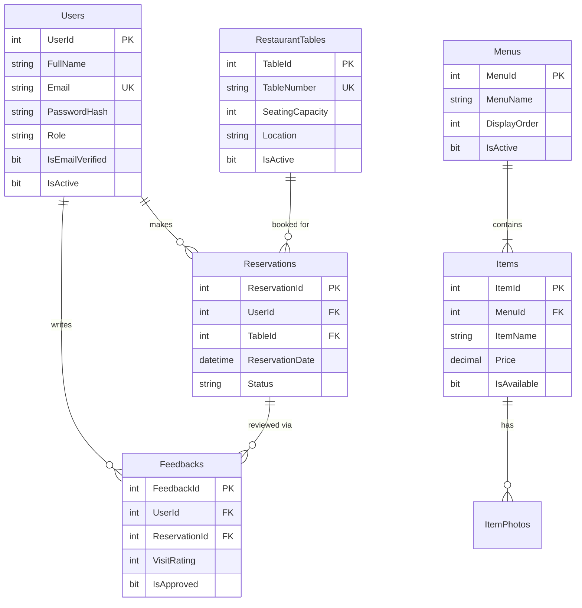

<div align="center">

# 🍽️ RestoApp

### Full-Stack Restaurant Management System web application

[](https://dotnet.microsoft.com/)
[](https://docs.microsoft.com/en-us/dotnet/csharp/)
[](https://docs.microsoft.com/en-us/sql/database-engine/configure-windows/sql-server-express-localdb)
[](https://getbootstrap.com/)
[](LICENSE)

A production-ready restaurant web application featuring a customer-facing storefront with menu browsing, table reservations, shopping cart, and reviews — alongside a comprehensive admin dashboard for full restaurant operations management.

</div>

---

## 📸 Screenshots

<details>
<summary><b>🏠 Customer-Facing Pages</b> (click to expand)</summary>
<br>

| Page              | Preview                                                 |
| ----------------- | ------------------------------------------------------- |
| **Home Page**     |                |
| **Menu & Items**  |       |
| **Item Details**  |             |
| **Shopping Cart** |                     |
| **Tables List**   |  |
| **Table Details** |           |
| **Book a Table**  |     |
| **Reviews**       |               |

</details>

<details>
<summary><b>🔐 Authentication Flow</b> (click to expand)</summary>
<br>

| Step                     | Preview                                                                                                                    |
| ------------------------ | -------------------------------------------------------------------------------------------------------------------------- |
| **Sign Up**              | .png>)                                      |
| **Email Verification**   | ).png>) |
| **Login**                | .png>)                                                           |
| **Forgot Password**      | .png>)                                       |
| **Reset Email Received** | .png>)                                         |
| **New Password Form**    | .png>)                                        |

</details>

<details>
<summary><b>⚙️ Admin Dashboard</b> (click to expand)</summary>
<br>

| Page                    | Preview                                                |
| ----------------------- | ------------------------------------------------------ |
| **Dashboard Overview**  |         |
| **Manage Menus**        |                |
| **Manage Items**        |                |
| **Manage Tables**       |              |
| **Manage Reservations** |  |
| **Manage Reviews**      |            |
| **Manage Users**        |                |

</details>

---

## ✨ Features

### 🛍️ Customer Portal

| Feature                | Description                                                                        |
| ---------------------- | ---------------------------------------------------------------------------------- |
| **Menu Browsing**      | Browse categorized menus with item photos, prices, ingredients, and origin details |
| **Table Reservations** | View available tables with photos and capacity, then book with date/time selection |
| **Shopping Cart**      | Session-based cart with add/remove functionality and quantity management           |
| **Customer Reviews**   | Submit star ratings and comments; view approved community reviews                  |
| **Secure Auth**        | Full signup → email verification → login flow with password reset capability       |

### ⚙️ Admin Dashboard

| Feature                 | Description                                                              |
| ----------------------- | ------------------------------------------------------------------------ |
| **Dashboard Analytics** | At-a-glance stats for users, reservations, items, and feedbacks          |
| **Menu Management**     | Create, edit, reorder, and toggle menu categories                        |
| **Item Management**     | Full CRUD for food/drink items with photos, pricing, and availability    |
| **Table Management**    | Configure tables with seating capacity, location, photos, and status     |
| **Reservation Control** | Approve, cancel, or complete bookings with automatic email notifications |
| **User Administration** | Manage roles (Admin/Client), activate/deactivate accounts                |
| **Review Moderation**   | Approve, reject, or delete customer feedback before public display       |

---

## 🛠️ Tech Stack

| Layer              | Technology                                                     |
| ------------------ | -------------------------------------------------------------- |
| **Frontend**       | HTML5, CSS3, Bootstrap 5.3, FontAwesome 6                      |
| **Backend**        | ASP.NET Web Forms, C# (.NET Framework 4.8)                     |
| **Database**       | SQL Server LocalDB with ADO.NET                                |
| **Authentication** | BCrypt.Net-Next (password hashing), HMAC-SHA256 (auth tokens)  |
| **Email**          | SMTP via Gmail (configurable in Web.config)                    |
| **Architecture**   | Repository Pattern, Master Page layout, Code-Behind separation |

---

## 🔒 Security

- **BCrypt Password Hashing** — Industry-standard password storage with cost factor 11
- **HMAC-SHA256 Auth Tokens** — Tamper-proof "Remember Me" cookies
- **Email Verification** — Token-based account activation with expiry
- **Secure Password Reset** — Time-limited reset tokens sent via email
- **Role-Based Authorization** — Admin pages protected with server-side role checks
- **SQL Injection Prevention** — Parameterized queries and table name whitelisting
- **XSS Protection** — HTML-encoded output with `<%: %>` syntax
- **HttpOnly Cookies** — Cookie theft prevention via `httpOnlyCookies` setting
- **Custom Error Pages** — No stack trace leakage in production (`customErrors`)

---

## 📁 Project Structure

```
RestoApp/
├── AdminRepo/              # Data access layer for admin operations
│   ├── FeedbackRepository  # CRUD for feedback moderation
│   ├── ItemRepository      # CRUD for menu items + photos
│   ├── MenuRepository      # CRUD for menu categories
│   ├── ReservationRepository # Reservation status management
│   ├── TableRepository     # CRUD for restaurant tables
│   └── UserRepository      # User role & status management
├── AdminView/              # Admin panel pages
│   ├── Dashboard/          # Stats overview
│   ├── Feedbacks/          # Review moderation
│   ├── Items/              # Item management
│   ├── Menus/              # Menu management
│   ├── Reservations/       # Booking management
│   ├── Tables/             # Table management
│   └── Users/              # User administration
├── App_Data/               # Database files
│   ├── RestoDB.mdf         # SQL Server LocalDB database
│   ├── restoDb.sql         # Schema creation script
│   └── dummyData.sql       # Sample seed data
├── Authentication/         # Auth pages
│   ├── Login.aspx          # User login
│   ├── Signup.aspx         # Registration + email verify
│   ├── ForgotPassword.aspx # Password reset request
│   ├── ResetPassword.aspx  # New password form
│   └── Verify.aspx         # Email verification
├── ClientRepo/             # Data access layer for customers
├── ClientsView/            # Customer-facing pages
│   ├── Cart/               # Shopping cart
│   ├── Feedbacks/          # Reviews display + submission
│   ├── Items/              # Item detail view
│   ├── Menu/               # Menu browsing
│   ├── Reservationn/       # Reservation request form
│   ├── TableDetails/       # Individual table view
│   └── Tables/             # Table listing + search
├── Helper/                 # Utilities
│   ├── DbHelper.cs         # Database connection manager
│   └── EmailService.cs     # SMTP email sender
├── Models/                 # Data models (POCOs)
├── Default.aspx            # Landing page
├── Site.Master             # Shared layout (navbar + footer)
└── Web.config              # App configuration
```

---

## 🗄️ Database Schema



---

## 🚀 Getting Started

### Prerequisites

- **Visual Studio 2019+** (with ASP.NET and web development workload)
- **SQL Server LocalDB** (included with Visual Studio)
- **.NET Framework 4.8** SDK

### Installation

1. **Clone the repository**

    ```bash
    git clone https://github.com/YOUR-USERNAME/RestoApp.git
    cd RestoApp
    ```

2. **Open in Visual Studio**

    ```
    Open RestoApp/RestoApp.slnx
    ```

3. **Set up the database**
    - Open SQL Server Object Explorer in Visual Studio
    - Connect to `(LocalDB)\MSSQLLocalDB`
    - Run `App_Data/restoDb.sql` to create the schema
    - Run `App_Data/dummyData.sql` to seed sample data

4. **Configure email** _(optional — for signup/reset flows)_
    - Update `Web.config` → `<appSettings>`:
        ```xml
        <add key="SmtpEmail" value="your-email@gmail.com" />
        <add key="SmtpPassword" value="your-app-password" />
        ```
    - Generate a [Gmail App Password](https://support.google.com/accounts/answer/185833) for the password field

5. **Run the application**
    - Press `F5` (debug) or `Ctrl+F5` (without debug)
    - The app opens at `http://localhost:PORT/`

### Demo Credentials

| Role       | Email                   | Password      |
| ---------- | ----------------------- | ------------- |
| **Admin**  | `alice.smith@email.com` | `Password123` |
| **Client** | `bob.jones@email.com`   | `Password123` |

---

## 📄 License

This project is licensed under the [MIT License](LICENSE).

---

<div align="center">

**Built with ❤️ as a full-stack portfolio project**

_Demonstrating ASP.NET Web Forms · C# · SQL Server · Bootstrap · Repository Pattern · Secure Authentication_

</div>

